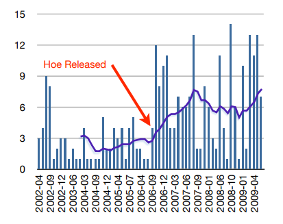
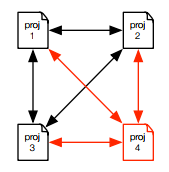
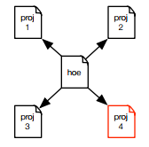

## What is Hoe?

Hoe is a library that provides extensions to rake to automate every step of the development
process from genesis to release. It provides project creation, configuration, and a multitude of
tasks including project maintenance, testing, analysis, and release. We found rake to be an
incredible vehicle for functionality _in the abstract_, but decidedly lacking in concrete functionality.
We filled in all the blanks we could through a "Hoe-spec":

``` ruby
require "hoe"
 Hoe.spec "project_name" do
 developer "Ryan Davis", "ryand-ruby@zenspider.com"
 # ...
end
```

A Hoe-spec declares everything about your project that is different from the defaults. From that,
Hoe creates a multitude of tasks and a gemspec used for packaging and release. Updating Hoe
updates all your projects that use Hoe. That's it. Nothing more is needed. Everything is DRY
(Don't Repeat Yourself).


## A Brief History of Hoe


Hoe was extracted from **pain**, not from fun. It was decidedly _not_ written in a vacuum. Pain to me
is repetition and mindless/needless work. At the time of this writing, a subset of seattle.rb
members have 88 projects with 439 releases; all but 86 of those releases were done with Hoe.
Pre-Hoe, an inordinate amount of time and effort was put into keeping those projects in sync with
each other. In other words, we know what we're talking about here and it ain't pretty.



Every time we found a new task that was useful to one project, it was probably useful to the rest
of them... but used in a _slightly_ different way. Resolving those edits across all the projects took
time away from writing fun/good/useful code. Every time we found a snafu in our release process
and wanted to improve it, we had to propagate those changes lest we have another snafu. In
short, we had code duplication across our projects, but on the release/package/process side. We
weren't DRY and at the time, there wasn't much available for process-oriented libraries. Through
this pain, Hoe was born.


## Why Use Hoe?

### Projects, the DRY way

> dry |drī|, adjective
>
> 5. A software engineering principal stating "Every piece of
> knowledge must have a single, unambiguous, authoritative
> representation within a system".


Hoe focuses on keeping everything in its place in a useful form and intelligently extracting what
it needs. There is no duplication of this information across your project. As a result, there are
no extra YAML files, config directories, ruby files, or any other artifacts in your release that you
wouldn't already have. As such, there is a lot less extra work you need to do to maintain your
projects.


### Update all your projects in 1 easy step

```
% gem update hoe
```

Hoe does minimal code generation. Just the barest amounts of Hoe are exposed in your
project (just the Rakefile). As such, updating Hoe's gem is an automatic update for all your
projects. The worst upgrades of Hoe require changing a line or two in your Rakefile.

**Change Propagation**



**Code Generation**

**-versus-**



**Code Reuse**


With code generation, each new project adds N new dependencies across all existing
projects. Any change to any project might propagate to every other project. With code reuse,
adding a new project has no impact on any other project.


### New projects in 1 easy step

```
% sow project_name
```

That's all you need to create a new project. And you can customize that to your heart's
content. All the files used for project creation are tweakable and are located in
`~/.hoe_template`.


### Run your tests in 1 easy step

```
% rake
```

Everything else is taken care of. Period.


### Releasing in 1 easy step

```
% rake release VERSION=x.y.z
```

That really is all there is to it. As-is, that command cleans your project, packages your project
into a gem and uploads it to rubygems.org. Tweak a couple knobs and add a plugin or two
and you can have it running your tests, validating against the manifest, posting to your blog or
mailing lists, or anything else you can think of.


That `VERSION=x.y.z` is there as a last-chance sanity check that you know what you're
releasing. You'd be surprised how blurry eyed/brained you get at 3AM. This check helps a lot
more often than it should.

### Noticing a pattern yet?

Hoe is designed to reduce code in your project and deliver a lot of power to you across all your
projects. It takes the mundane and redundant out of your project and lets you focus the actual
project.

### Extensibility

``` ruby
Hoe.plugin :my_hoe_extension
```

Hoe has a powerful plugin system that lets you tweak to your heart's content. Want to have git
integration? No problem! There is a plugin for that or whatever VC you like. Want to automate
sending out an email or posting to your blog every time you release? There is a plugin for that
too. Writing a C extension and you don't want to deal with all the hassle of getting it set up and
built? Done.


And if you have something specific to your company or used across all of your open source
projects, plugin writing is a great way to DRY up your projects. Imagine taking all those tasks/\*.rake files
and substituting them with a simple `Hoe.plugin` line. All that code can be
consolidated, put into its own gem, versioned properly, released, and reused with ease. No
more version skew. No more copy and paste. No more junk littering your projects.


**This is the _real_ power of Hoe.**


## Creating a new Project

### From Scratch

The easiest way to get started with Hoe is to use its included command-line tool `sow`:

```
% sow my_shiny_project
```

That will create a new directory `my_shiny_project` with a skeletal project inside. You need to
edit the Rakefile with developer information in order to meet the minimum requirements of a
working Hoe-spec. You should also go fix all the things it points out as being labeled with `FIX`
in the README.txt file.


``` ruby
require 'hoe'

 Hoe.spec 'my_shiny_project' do
   developer 'Ryan Davis', 'ryand-ruby@zenspider.com'

   extra_deps << 'whatevs'
 end
```

### Using Sow Templates


If you're planning on releasing a lot (aka: 2 or more) of packages and you've got certain recipes
you like to have in your project, do note that sow uses a template directory and ERB to create
your project. The first time you run sow it creates `~/.hoe_template`. Make modifications there
and every subsequent project will have those changes. For example, my default Hoe template
looks like:

``` ruby
Hoe.plugin :isolate
Hoe.plugin :seattlerb

Hoe.spec "<%= project %>" do
  developer "Ryan Davis", "ryand-ruby@zenspider.com"
  license "MIT"
end
```


## Work the Way You Want to Work

Hoe tries its best to stay out of your way. While it follows a bunch of conventions, it doesn't
enforce very much at all.

**Version control agnostic.**

Hoe doesn't assume anything about HOW you work. Git? SVN? Perforce? Great! Hoe doesn't
care, but there is probably a hoe plugin that will support whatever you use.


**Test framework agnostic.**

Hoe doesn't care how you test your code. Hoe works out of the box for test/unit, minitest,
shoulda, rspec... And it is very easy to support others.


## Project Structure

Hoe encourages the canonical rubygems setup with all the usual extras to make your project
maintainable and approachable:

**`lib/\*\*/\*.rb`**

All your source goes in here, as usual.


**`{test,spec}/\*\*/\*.rb`**

All your tests go in here, as usual.

**`bin/\*`**

Commandline executables go in here, if you have any.

**`README.txt`**

Most projects have a readme file of some kind that describes the project. Hoe is no different.
The readme file points the reader towards all the information they need to know to get started
including a description, relevant urls, code synopsis, license, etc. Hoe knows how to read a
basic rdoc/markdown formatted file to pull out the description (and summary by extension),
urls, and extra paragraphs of info you may want to provide in news/blog posts.

**`History.txt`**

Every project should have a document describing changes over time. Hoe can read this file
(also in rdoc/markdown) and include the latest changes in your announcements.

**`Manifest.txt`**

Every project should know what it is shipping. This is done via an explicit list of everything that
goes out in a release. Hoe uses this during packaging so that nothing wrong or embarrassing
is picked up.

**`VERSION`**

Releases have versions and I've found it best for the version to be part of the code. You can
use this during runtime in a multitude of ways. Hoe finds your VERSION constant in your code
and uses it automatically during packaging.

``` ruby
class MyShinyProject
  VERSION = "1.0.0"
  # ...
end
```

## Extending Hoe with Plugins

Hoe has a flexible plugin system with the release of 2.0. This allowed Hoe to be refactored. That in
and of itself was worth the effort. Probably more important is that it allows you to customize your
projects' tasks in a modular and reusable way


### Using Hoe Plugins

Using a Hoe plugin is incredibly easy. Activate it by calling Hoe.plugin like so:

``` ruby
Hoe.plugin :minitest
```

This will activate the `Hoe::Minitest` plugin, attach it and load its tasks and methods into your
Hoe-spec. Easy-peasy!


### Popular Hoe Plugins

Here are some examples of plugins that are available:

**hoe-bundler gem**

Generates a Gemfile based on a Hoe's declared dependencies.

**hoe-debugging gem, :compiler plugin (ships with hoe)**

Help you build and debug your ruby C extensions.

**hoe-doofus gem**

Helps keep you from messing up gem releases.

**hoe-git & hoe-hg**

These plugins provide git and mercurial integration.

**hoe-seattlerb**

Plugin bundle for minitest, email announcements, perforce support, and release branching.


### Writing Hoe Plugins

If the existing plugins don't meet your needs, it is very simple to write your own. A plugin can
be as simple as:


``` ruby
module Hoe::CompanysStuff
 attr_accessor :thingy

 def initialize_companys_stuff # optional
   self.thingy = 42
 end

 def define_companys_stuff_tasks # required
   task :thingy do
     puts thingy
   end
 end
end
```

Not terribly useful, but you get the idea. This example exercises both plugin methods
`(initialize_#{plugin}` and `define_#{plugin}_tasks)`
and adds an accessor method to the Hoe
instance. Only the define method is required but sometimes it is left blank if all you want is an
initialize method that sets some values for you.


### How Plugins Work

Hoe plugins are made to be as simple as possible, but no simpler. They are modules defined in
the `Hoe` namespace and have only one required method `(define_#{plugin}_tasks)` and one
optional method `(initialize_#{plugin})`. Plugins can also define their own methods and they'll be
available as instance methods to your Hoe-spec. Plugins have 4 simple phases:

**Loading**

When Hoe is loaded the last thing it does is to ask rubygems for all of its plugins. Plugins
are found by finding all files matching `"hoe/\*.rb"`
via installed gems or `$LOAD_PATH`. All
found files are then loaded.


**Activation**

All of the plugins that ship with Hoe are activated by default. This is because they're
providing the same functionality that the previous Hoe was and without them, it'd be mostly
useless. Other plugins are activated by:

``` ruby
Hoe.plugin :thingy
```

Put this _above_ your Hoe-spec. All it does is add `:thingy` to the array returned by
`Hoe.plugins`. You could also deactivate a plugin by removing it from `Hoe.plugins` although
that shouldn't be necessary for the most part.


One nice thing about plugins is that they are "soft". If you download a project from github
and it requests a plugin that you don't have installed, rake won't freak out and die. You may
not get the full set of tasks that the project developers have available, but you still have
enough to play with the project.


**Initialization**

When your Hoe-spec is instantiated, it calls **extend** on itself with all known plugin modules.
This adds the method bodies to the Hoe-spec instance and allows for the plugin to work as
part of the spec itself. Once that is over, activated plugins have their **optional** define
**initialize_#{plugin}** methods called. This lets them set needed instance variables to default
values. Finally, the Hoe-spec block is evaluated so that project specific values can override
the defaults.

**Task Definition**

Finally, once the user's Hoe-spec has been evaluated, all activated plugins have their
**define_#{plugin}_tasks** method called. This method must be defined and it is here that
you'll define all your tasks.


## Questions & Counterpoints

### "Why should I maintain a Manifest.txt when I can just write a glob?"

> manifest2 |ˈmønəˈfɛst| |ˈmanɪfɛst|, noun
>
> a document giving comprehensive details of a ship and its
> cargo and other contents, passengers, and crew for the use
> of customs officers.

Imagine, you're a customs inspector at the Los Angeles Port, the world's largest import/export
port. A large ship filled to the brim pulls up to the pier ready for inspection. You walk up to the
captain and his crew and ask "what is the contents of this fine ship today" and the captain
answers "oh... whatever is inside". The mind boggles. There is no way in the world that a
professionally run ship would ever run this way and there is no way that you should either.


Professional software releases know _exactly_ what is in them, amateur releases do not. "Write
better globs" is the response I often hear. I consider myself and the people I work with to be
rather smart people and if we get them wrong, chances are you will too. How many times have
you peered under the covers and seen .DS_Store, emacs backup~ files, vim swp files and
other files completely unrelated to the package? I have far more times than I'd like.

We've even seen a gem that includes every gem released before it inside (recursively!).

You avoid all of this pain and embarrassment with a simple text file.


### "Why not just write gemspecs?"

I've done that and it is way too much work.

First off, the question is short-sighted. A project is a lot more than just a gemspec and Hoe
handles all of it. Second, it isn't DRY. All my projects have a history file, a readme, some code
with a version string, etc. Why should I duplicate all of that information into the gem spec when
I can have code do it for me automatically? It is less error prone as a result. I screw up things,
Hoe doesn't.

See that Hoe spec above for the fictional "my_shiny_project" project? This is the
corresponding gem spec in all its glory (as cleaned up as I can/am willing to get it):

```ruby
# -*- encoding: utf-8 -*-

Gem::Specification.new do |s|
  s.name             = "my_shiny_project"
  s.version          = "1.0.0"

  s.authors          = ["Ryan Davis"]
  s.description      = "..."
  s.email            = ["ryand-ruby@zenspider.com"]
  s.executables      = ["my_shiny_project"]
  s.extra_rdoc_files = [...]
  s.files            = [...]
  s.homepage         = "..."
  s.rdoc_options     = ["--main", "README.txt"]
  s.summary          = "..."
  s.test_files       = [...]

  s.cert_chain       = ["/Users/ryan/.gem/gempublic_cert.pem"]
  s.signing_key      = "/Users/ryan/.gem/gem-private_key.pem"

  s.add_runtime_dependency(%q<whatevs>, [">= 0"])
end
```

And that doesn't even cover the rake tasks… the code duplication… the versioning… etc.

Gross, no? If you say "no", well, have fun with that. I won't try to convince you any further. I've
got real stuff to do while you tweak your spec ad nauseum.


### "What about (newgem|bones|echoe|joe|gemify|...)?"

Smoke 'em if ya got 'em.

All I can really say is that Hoe works really well for me and a lot of others (rdoc, nokogiri, etc).
